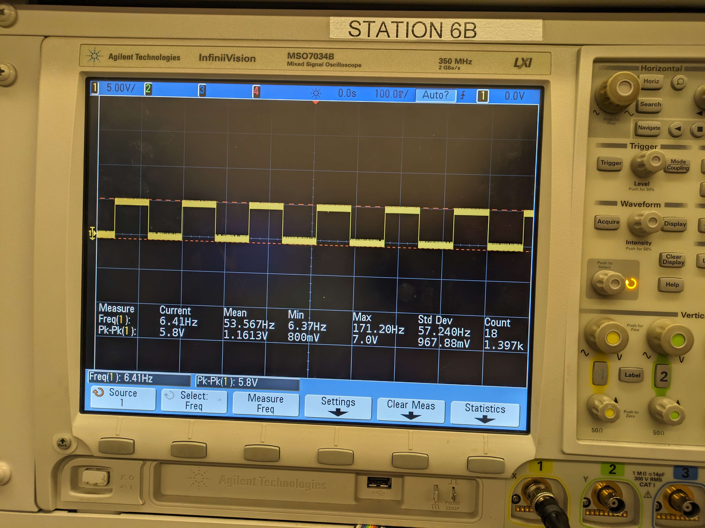

# Final Report

## Video



 

## Final Project Images

||||
|-|-|-|
|  |  |  |
|  |  |  |
|  |  |   |
|  |  | |

## Progress Photos

## Results

Our final design was what we had envisioned from the start. It is a laser-cut acrylic enclosure containing the electronics, with 23 buttons, a rotary encoder, a screen, sync jack, and the OPL2 accessible from the top panel. 16 of the buttons have integrated LEDs to display information about the drum pattern and playback, while the other 7 are unlit. It allows for the creation and playback of 6 channel, 16-step drum sequences, with the ability to modify 4 per channel settings, as well as global tempo control.

## Specifications Results

### SRS

SRS 01 &mdash; When no channel is selected, users shall be able to use an on-screen menu to set a tempo in a range of 60-300 BPM.

SRS 02 &mdash; The software shall use a PWM timer with a frequency of `floor(8000000 / (2 * 64 * (tempo * 4 / 60)))`. A pin shall be driven high or low in accordance with this pulse signal.

SRS 03 &mdash; When the sequencer is running, for each step, for each channel for which that step is active, a sound corresponding to the channel shall be played by the YM3812.

SRS 04 &mdash; Users shall be able to start or stop the sequencer at any time. Playback shall always start from the first step whenever the sequencer is started.

SRS 05 &mdash; Users shall be able to change the current instrument channel as well as set the active steps for that channel at any time.

SRS 06 &mdash; Using an on-screen menu, users shall be able to modify the tuning and volume of the current instrument channel.

Our final design meets all software requirements. Our requirements changed slightly over time due to the timing needs of the serial interfaces and the sequencer. SRS02 was updated accordingly. Additionally, we made it possible to modify tempo at all times, rather than only when no instrument channel is selected (it is also not possible to not have one selected), slightly differing from SRS01.

Testing the majority of the requirements were tested just by using the device, as whether or not they are met is easily perceived without measurement tools.

The frequency of the signal on the sync port was measured using an oscilloscope to test SRS02.

### HRS

HRS 01 &mdash; ATmega328PB will be the main microcontroller for this design

HRS 02 &mdash; An adafruit GPIO expander to expand the amount of available pins/registers we have access to

HRS 03 &mdash; 16 pushbuttons to represent different notes in a measure

HRS 04 &mdash; 6 more pushbuttons to represent types of drums

HRS 05 &mdash; 1.8” 128x160 TFT LCD module to display the tempo, volume and the current drum setting

HRS 06 &mdash; OPL2 Audio Board using a Yamaha YM3812 sound chip with SPI interfacing for audio synthesizing

HRS 07 &mdash; A rotary encoder for controlling the screen menus and the volume

Our final design meets all hardware requirements. No changes were made to our hardware requirements over the course of the project.

## Conclusion

<b>Mia:</b> I think the primary thing I learned is the importance of spare components. We had one of our GPIO expanders, and many of the LEDs in our buttons, break, and we were saved by the parts being ordered twice by the Detkin staff. When our encoder broke, and we had to wait after putting in a new order, it delayed getting that aspect finished until a few days before the final demo. Other than some issues with broken components, just about everything went well. In my opinion, we achieved exactly what we set out to do, with the final device having all planned features and functioning very reliably. One unexpected (well, somewhat expected) issue was that the slowness of drawing characters to the LCD necessitated a minor change to the design of the GUI. Instead of changing it entirely for the tempo selection, I added the tempo to be displayed on the per-instrument screens, and removed the global settings screen. This was a simple change though that didn't affect anything else. With the fact that everything works so reliably and the number wires are becoming unmanageable, I think a good next step (that I plan on taking) would be to design a PCB to make the hardware more compact and easy to manage.

<b>Madison:</b> I think I am very proud of how the project turned out. I think we did really well with time management and worked very steadily up until the last day. We ended up therefore neveer feeling very crunched with time. The only thing that ended up being very stressful was (like Mia said) some of the components breaking and us needing to fix them kind of last minute. I think in the future I would have liked to work on the casing a bit more and get it to be a little bit better functionally and stylistically. Other than that, I was pleased with the electrical componenets/systems and work that we were able to do. I would love to do more work with creating music machines like this like perhaps a keyboard. It reminded me of the far reaching impact of the field of electrical engineering and how it is present and could be used to impact all different aspects of life.

## References

Adapted the Arduino OPL2 library to bare metal C:\
<https://github.com/DhrBaksteen/ArduinoOPL2>\
Referenced Adafruit Seesaw library when implementing the encoder functionality:\
<https://github.com/adafruit/Adafruit_Seesaw/tree/master>
